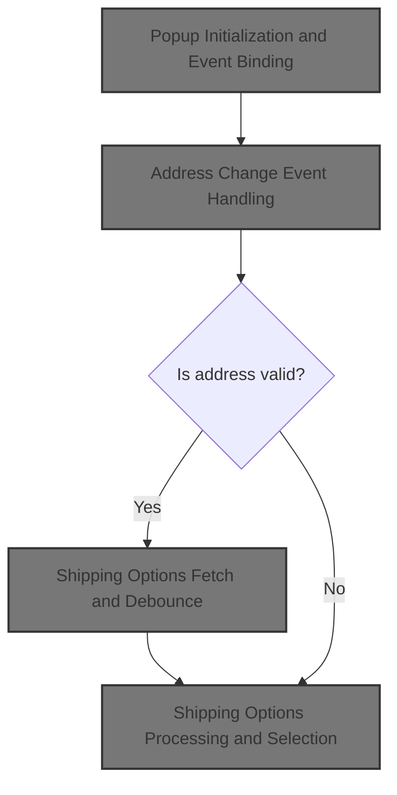

This document describes how users can estimate shipping costs by entering their address in a popup. As users update their address, the system fetches and displays available shipping options, allowing them to select the most suitable method. The flow ensures options are refreshed with each address change and preserves previous selections when possible.



# Popup Initialization and Event Binding

This section governs how the estimate shipping popup is initialized and how it responds to user interactions, ensuring that shipping options are always up-to-date and selectable based on the user's address input.

| Category        | Rule Name                       | Description                                                                                                                                                                                                         |
| --------------- | ------------------------------- | ------------------------------------------------------------------------------------------------------------------------------------------------------------------------------------------------------------------- |
| Data validation | Valid Shipping Option Selection | The popup must only allow the user to apply a shipping option if the selected option includes both a provider and a price.                                                                                          |
| Business logic  | Dynamic Shipping Option Refresh | Whenever the user changes any address field (country, state/province, zip/postal code, and city if enabled), the system must clear the current shipping options and fetch new options based on the updated address. |
| Business logic  | Request Delay Enforcement       | The popup must use a delay of 300 milliseconds before sending a request for new shipping options after an address change, to avoid excessive requests and improve performance.                                      |
| Business logic  | Custom Popup Open Handler       | When the popup is opened, any custom handler defined for the open event must be executed to allow for additional business logic or UI customization.                                                                |

<SwmSnippet path="/src/Presentation/Nop.Web/wwwroot/js/public.estimateshipping.popup.js" line="1">

---

In <SwmToken path="src/Presentation/Nop.Web/wwwroot/js/public.estimateshipping.popup.js" pos="1:3:3" line-data="function createEstimateShippingPopUp(settings) {">`createEstimateShippingPopUp`</SwmToken>, we set up the popup and event handlers so that whenever the address changes, we trigger a fetch for new shipping options to keep the UI in sync with user input.

```javascript
function createEstimateShippingPopUp(settings) {
  var defaultSettings = {
    opener: false,
    form: false,
    requestDelay: 300,
    urlFactory: false,
    handlers: {},
    localizedData: false,
    contentEl: false,
    countryEl: false,
    stateProvinceEl: false,
    zipPostalCodeEl: false,
    useCity: false,
    cityEl: false,
    errorMessageBoxClass: 'message-failure',
  };

  return {
    settings: $.extend({}, defaultSettings, settings),
    params: {
      jqXHR: false,
      displayErrors: false,
      delayTimer: false,
      selectedShippingOption: false
    },

    init: function () {
      var self = this;
      var $content = $(this.settings.contentEl);

      $('.apply-shipping-button', $content).on('click', function () {
        var option = self.getActiveShippingOption();
        if (option && option.provider && option.price) {
          self.selectShippingOption(option);
          self.closePopup();
        }
      });

      $(this.settings.opener).magnificPopup({
        type: 'inline',
        removalDelay: 500,
        callbacks: {
          beforeOpen: function () {
            this.st.mainClass = this.st.el.attr('data-effect');
          },
          open: function () {
            if (self.settings.handlers.openPopUp)
              self.settings.handlers.openPopUp();

            self.params.displayErrors = true;
          }
        }
      });

      var addressChangedHandler = function () {
        self.clearShippingOptions();
        var address = self.getShippingAddress();
        self.getShippingOptions(address);
      };
```

---

</SwmSnippet>

## Shipping Options Fetch and Debounce

```mermaid
%%{init: {"flowchart": {"defaultRenderer": "elk"}} }%%
flowchart TD
  node1["User requests shipping options"] --> node2{"Is address valid?"}
  click node1 openCode "src/Presentation/Nop.Web/wwwroot/js/public.estimateshipping.popup.js:77:113"
  node2 -->|"No"| node3["Stop: Invalid address"]
  click node2 openCode "src/Presentation/Nop.Web/wwwroot/js/public.estimateshipping.popup.js:78:79"
  click node3 openCode "src/Presentation/Nop.Web/wwwroot/js/public.estimateshipping.popup.js:79:79"
  node2 -->|"Yes"| node4["Show loading indicator"]
  click node4 openCode "src/Presentation/Nop.Web/wwwroot/js/public.estimateshipping.popup.js:83:83"
  node4 --> node5{"Is there a load handler?"}
  click node5 openCode "src/Presentation/Nop.Web/wwwroot/js/public.estimateshipping.popup.js:85:86"
  node5 -->|"Yes"| node6["Call load handler"]
  click node6 openCode "src/Presentation/Nop.Web/wwwroot/js/public.estimateshipping.popup.js:86:86"
  node5 -->|"No"| node8["Abort previous request if needed"]
  node6 --> node8
  click node8 openCode "src/Presentation/Nop.Web/wwwroot/js/public.estimateshipping.popup.js:88:91"
  node8 --> node9["Wait for request delay"]
  click node9 openCode "src/Presentation/Nop.Web/wwwroot/js/public.estimateshipping.popup.js:112:112"
  node9 --> node10{"Is there a URL for shipping options?"}
  click node10 openCode "src/Presentation/Nop.Web/wwwroot/js/public.estimateshipping.popup.js:93:94"
  node10 -->|"No"| node11["Stop: No shipping options available"]
  click node11 openCode "src/Presentation/Nop.Web/wwwroot/js/public.estimateshipping.popup.js:111:111"
  node10 -->|"Yes"| node12["Request shipping options"]
  click node12 openCode "src/Presentation/Nop.Web/wwwroot/js/public.estimateshipping.popup.js:95:110"
  node12 --> node13{"Response received"}
  click node13 openCode "src/Presentation/Nop.Web/wwwroot/js/public.estimateshipping.popup.js:100:109"
  node13 -->|"Success"| node14["Show available shipping options"]
  click node14 openCode "src/Presentation/Nop.Web/wwwroot/js/public.estimateshipping.popup.js:101:102"
  node13 -->|"Error"| node15["Show error message"]
  click node15 openCode "src/Presentation/Nop.Web/wwwroot/js/public.estimateshipping.popup.js:103:105"
  node13 -->|"Complete"| node16["Finalize request"]
  click node16 openCode "src/Presentation/Nop.Web/wwwroot/js/public.estimateshipping.popup.js:106:109"

classDef HeadingStyle fill:#777777,stroke:#333,stroke-width:2px;

%% Swimm:
%% %%{init: {"flowchart": {"defaultRenderer": "elk"}} }%%
%% flowchart TD
%%   node1["User requests shipping options"] --> node2{"Is address valid?"}
%%   click node1 openCode "<SwmPath>[src/…/js/public.estimateshipping.popup.js](src/Presentation/Nop.Web/wwwroot/js/public.estimateshipping.popup.js)</SwmPath>:77:113"
%%   node2 -->|"No"| node3["Stop: Invalid address"]
%%   click node2 openCode "<SwmPath>[src/…/js/public.estimateshipping.popup.js](src/Presentation/Nop.Web/wwwroot/js/public.estimateshipping.popup.js)</SwmPath>:78:79"
%%   click node3 openCode "<SwmPath>[src/…/js/public.estimateshipping.popup.js](src/Presentation/Nop.Web/wwwroot/js/public.estimateshipping.popup.js)</SwmPath>:79:79"
%%   node2 -->|"Yes"| node4["Show loading indicator"]
%%   click node4 openCode "<SwmPath>[src/…/js/public.estimateshipping.popup.js](src/Presentation/Nop.Web/wwwroot/js/public.estimateshipping.popup.js)</SwmPath>:83:83"
%%   node4 --> node5{"Is there a load handler?"}
%%   click node5 openCode "<SwmPath>[src/…/js/public.estimateshipping.popup.js](src/Presentation/Nop.Web/wwwroot/js/public.estimateshipping.popup.js)</SwmPath>:85:86"
%%   node5 -->|"Yes"| node6["Call load handler"]
%%   click node6 openCode "<SwmPath>[src/…/js/public.estimateshipping.popup.js](src/Presentation/Nop.Web/wwwroot/js/public.estimateshipping.popup.js)</SwmPath>:86:86"
%%   node5 -->|"No"| node8["Abort previous request if needed"]
%%   node6 --> node8
%%   click node8 openCode "<SwmPath>[src/…/js/public.estimateshipping.popup.js](src/Presentation/Nop.Web/wwwroot/js/public.estimateshipping.popup.js)</SwmPath>:88:91"
%%   node8 --> node9["Wait for request delay"]
%%   click node9 openCode "<SwmPath>[src/…/js/public.estimateshipping.popup.js](src/Presentation/Nop.Web/wwwroot/js/public.estimateshipping.popup.js)</SwmPath>:112:112"
%%   node9 --> node10{"Is there a URL for shipping options?"}
%%   click node10 openCode "<SwmPath>[src/…/js/public.estimateshipping.popup.js](src/Presentation/Nop.Web/wwwroot/js/public.estimateshipping.popup.js)</SwmPath>:93:94"
%%   node10 -->|"No"| node11["Stop: No shipping options available"]
%%   click node11 openCode "<SwmPath>[src/…/js/public.estimateshipping.popup.js](src/Presentation/Nop.Web/wwwroot/js/public.estimateshipping.popup.js)</SwmPath>:111:111"
%%   node10 -->|"Yes"| node12["Request shipping options"]
%%   click node12 openCode "<SwmPath>[src/…/js/public.estimateshipping.popup.js](src/Presentation/Nop.Web/wwwroot/js/public.estimateshipping.popup.js)</SwmPath>:95:110"
%%   node12 --> node13{"Response received"}
%%   click node13 openCode "<SwmPath>[src/…/js/public.estimateshipping.popup.js](src/Presentation/Nop.Web/wwwroot/js/public.estimateshipping.popup.js)</SwmPath>:100:109"
%%   node13 -->|"Success"| node14["Show available shipping options"]
%%   click node14 openCode "<SwmPath>[src/…/js/public.estimateshipping.popup.js](src/Presentation/Nop.Web/wwwroot/js/public.estimateshipping.popup.js)</SwmPath>:101:102"
%%   node13 -->|"Error"| node15["Show error message"]
%%   click node15 openCode "<SwmPath>[src/…/js/public.estimateshipping.popup.js](src/Presentation/Nop.Web/wwwroot/js/public.estimateshipping.popup.js)</SwmPath>:103:105"
%%   node13 -->|"Complete"| node16["Finalize request"]
%%   click node16 openCode "<SwmPath>[src/…/js/public.estimateshipping.popup.js](src/Presentation/Nop.Web/wwwroot/js/public.estimateshipping.popup.js)</SwmPath>:106:109"
%% 
%% classDef HeadingStyle fill:#777777,stroke:#333,stroke-width:2px;
```



This section governs how shipping options are fetched and displayed to users based on their provided address, ensuring only valid requests are processed, minimizing unnecessary server calls, and providing clear feedback to the user.

| Category        | Rule Name                           | Description                                                                                                                                                                                                                                                                                 |
| --------------- | ----------------------------------- | ------------------------------------------------------------------------------------------------------------------------------------------------------------------------------------------------------------------------------------------------------------------------------------------- |
| Data validation | Address validation required         | Shipping options are only fetched if the provided address passes validation checks.                                                                                                                                                                                                         |
| Data validation | Require shipping options URL        | If no URL can be generated for the shipping options request, the process must stop and no shipping options are shown.                                                                                                                                                                       |
| Business logic  | Show loading indicator              | A loading indicator must be shown to the user while shipping options are being fetched.                                                                                                                                                                                                     |
| Business logic  | Abort previous request on new input | If a new request for shipping options is made before the previous one completes, the previous request must be aborted to prevent outdated results.                                                                                                                                          |
| Business logic  | Debounce shipping requests          | A delay of a specified duration (<SwmToken path="src/Presentation/Nop.Web/wwwroot/js/public.estimateshipping.popup.js" pos="5:1:1" line-data="    requestDelay: 300,">`requestDelay`</SwmToken>) must be applied before sending the shipping options request, to debounce rapid user input. |
| Business logic  | Display available shipping options  | If the server returns shipping options successfully, they must be displayed to the user.                                                                                                                                                                                                    |

<SwmSnippet path="/src/Presentation/Nop.Web/wwwroot/js/public.estimateshipping.popup.js" line="77">

---

<SwmToken path="src/Presentation/Nop.Web/wwwroot/js/public.estimateshipping.popup.js" pos="77:1:1" line-data="    getShippingOptions: function (address) {">`getShippingOptions`</SwmToken> handles fetching shipping options from the server. It validates the address, sets a loading state, and uses a delay timer to debounce requests. If a new request is triggered before the previous one finishes, it aborts the old request. The AJAX call uses a URL generated from the address and sends serialized form data. On success, it calls <SwmToken path="src/Presentation/Nop.Web/wwwroot/js/public.estimateshipping.popup.js" pos="101:3:3" line-data="              self.successHandler(address, response);">`successHandler`</SwmToken> to process and display the options.

```javascript
    getShippingOptions: function (address) {
      if (!this.validateAddress(address))
        return;

      var self = this;

      self.setLoadWaiting();

      if (self.settings.handlers.load)
        self.settings.handlers.load();

      clearTimeout(self.params.delayTimer);
      self.params.delayTimer = setTimeout(function () {
        if (self.params.jqXHR && self.params.jqXHR.readyState !== 4)
          self.params.jqXHR.abort();

        var url = self.settings.urlFactory(address);
        if (url) {
          self.params.jqXHR = $.ajax({
            cache: false,
            url: url,
            data: $(self.settings.form).serialize(),
            type: 'POST',
            success: function (response) {
              self.successHandler(address, response);
            },
            error: function (jqXHR, textStatus, errorThrown) {
              self.errorHandler(jqXHR, textStatus, errorThrown);
            },
            complete: function (jqXHR, textStatus) {
              if (self.settings.handlers.complete)
                self.settings.handlers.complete(jqXHR, textStatus);
            }
          });
        }
      }, self.settings.requestDelay);
    },
```

---

</SwmSnippet>

## Shipping Options Processing and Selection

```mermaid
%%{init: {"flowchart": {"defaultRenderer": "elk"}} }%%
flowchart TD
  node1["Clear previous shipping options"] --> node2{"Was shipping estimate successful?"}
  click node1 openCode "src/Presentation/Nop.Web/wwwroot/js/public.estimateshipping.popup.js:121:121"
  node2 -->|"Yes"| node3{"Are there shipping options?"}
  click node2 openCode "src/Presentation/Nop.Web/wwwroot/js/public.estimateshipping.popup.js:123:165"
  node2 -->|"No"| node10["Clear errors and show error message"]
  click node10 openCode "src/Presentation/Nop.Web/wwwroot/js/public.estimateshipping.popup.js:166:170"
  node3 -->|"Yes"| node4["Process shipping options"]
  click node3 openCode "src/Presentation/Nop.Web/wwwroot/js/public.estimateshipping.popup.js:126:162"
  node3 -->|"No"| node9["Clear shipping options"]
  click node9 openCode "src/Presentation/Nop.Web/wwwroot/js/public.estimateshipping.popup.js:163:164"

  subgraph loop1["For each shipping option"]
    node4 --> node5{"Is this option selected or matches previous selection and address?"}
    click node5 openCode "src/Presentation/Nop.Web/wwwroot/js/public.estimateshipping.popup.js:133:136"
    node5 -->|"Yes"| node6["Set as active option"]
    click node6 openCode "src/Presentation/Nop.Web/wwwroot/js/public.estimateshipping.popup.js:137:142"
    node5 -->|"No"| node7["Display shipping option"]
    click node7 openCode "src/Presentation/Nop.Web/wwwroot/js/public.estimateshipping.popup.js:144:144"
    node6 --> node7
    node7 --> node4
  end

  node4 --> node8{"Was an active option selected?"}
  click node8 openCode "src/Presentation/Nop.Web/wwwroot/js/public.estimateshipping.popup.js:148:155"
  node8 -->|"No"| node11["Set first option as active"]
  click node11 openCode "src/Presentation/Nop.Web/wwwroot/js/public.estimateshipping.popup.js:149:154"
  node8 -->|"Yes"| node12["Proceed"]
  node11 --> node12

  node12 --> node13{"Is popup closed and previous selection matches address?"}
  click node13 openCode "src/Presentation/Nop.Web/wwwroot/js/public.estimateshipping.popup.js:158:159"
  node13 -->|"Yes"| node14["Reload selected shipping option"]
  click node14 openCode "src/Presentation/Nop.Web/wwwroot/js/public.estimateshipping.popup.js:159:159"
  node13 -->|"No"| node15["Set active shipping option"]
  click node15 openCode "src/Presentation/Nop.Web/wwwroot/js/public.estimateshipping.popup.js:161:161"

  node10 --> node16["Call external success handler"]
  click node16 openCode "src/Presentation/Nop.Web/wwwroot/js/public.estimateshipping.popup.js:172:173"
  node9 --> node16
  node15 --> node16
  node14 --> node16
classDef HeadingStyle fill:#777777,stroke:#333,stroke-width:2px;

%% Swimm:
%% %%{init: {"flowchart": {"defaultRenderer": "elk"}} }%%
%% flowchart TD
%%   node1["Clear previous shipping options"] --> node2{"Was shipping estimate successful?"}
%%   click node1 openCode "<SwmPath>[src/…/js/public.estimateshipping.popup.js](src/Presentation/Nop.Web/wwwroot/js/public.estimateshipping.popup.js)</SwmPath>:121:121"
%%   node2 -->|"Yes"| node3{"Are there shipping options?"}
%%   click node2 openCode "<SwmPath>[src/…/js/public.estimateshipping.popup.js](src/Presentation/Nop.Web/wwwroot/js/public.estimateshipping.popup.js)</SwmPath>:123:165"
%%   node2 -->|"No"| node10["Clear errors and show error message"]
%%   click node10 openCode "<SwmPath>[src/…/js/public.estimateshipping.popup.js](src/Presentation/Nop.Web/wwwroot/js/public.estimateshipping.popup.js)</SwmPath>:166:170"
%%   node3 -->|"Yes"| node4["Process shipping options"]
%%   click node3 openCode "<SwmPath>[src/…/js/public.estimateshipping.popup.js](src/Presentation/Nop.Web/wwwroot/js/public.estimateshipping.popup.js)</SwmPath>:126:162"
%%   node3 -->|"No"| node9["Clear shipping options"]
%%   click node9 openCode "<SwmPath>[src/…/js/public.estimateshipping.popup.js](src/Presentation/Nop.Web/wwwroot/js/public.estimateshipping.popup.js)</SwmPath>:163:164"
%% 
%%   subgraph loop1["For each shipping option"]
%%     node4 --> node5{"Is this option selected or matches previous selection and address?"}
%%     click node5 openCode "<SwmPath>[src/…/js/public.estimateshipping.popup.js](src/Presentation/Nop.Web/wwwroot/js/public.estimateshipping.popup.js)</SwmPath>:133:136"
%%     node5 -->|"Yes"| node6["Set as active option"]
%%     click node6 openCode "<SwmPath>[src/…/js/public.estimateshipping.popup.js](src/Presentation/Nop.Web/wwwroot/js/public.estimateshipping.popup.js)</SwmPath>:137:142"
%%     node5 -->|"No"| node7["Display shipping option"]
%%     click node7 openCode "<SwmPath>[src/…/js/public.estimateshipping.popup.js](src/Presentation/Nop.Web/wwwroot/js/public.estimateshipping.popup.js)</SwmPath>:144:144"
%%     node6 --> node7
%%     node7 --> node4
%%   end
%% 
%%   node4 --> node8{"Was an active option selected?"}
%%   click node8 openCode "<SwmPath>[src/…/js/public.estimateshipping.popup.js](src/Presentation/Nop.Web/wwwroot/js/public.estimateshipping.popup.js)</SwmPath>:148:155"
%%   node8 -->|"No"| node11["Set first option as active"]
%%   click node11 openCode "<SwmPath>[src/…/js/public.estimateshipping.popup.js](src/Presentation/Nop.Web/wwwroot/js/public.estimateshipping.popup.js)</SwmPath>:149:154"
%%   node8 -->|"Yes"| node12["Proceed"]
%%   node11 --> node12
%% 
%%   node12 --> node13{"Is popup closed and previous selection matches address?"}
%%   click node13 openCode "<SwmPath>[src/…/js/public.estimateshipping.popup.js](src/Presentation/Nop.Web/wwwroot/js/public.estimateshipping.popup.js)</SwmPath>:158:159"
%%   node13 -->|"Yes"| node14["Reload selected shipping option"]
%%   click node14 openCode "<SwmPath>[src/…/js/public.estimateshipping.popup.js](src/Presentation/Nop.Web/wwwroot/js/public.estimateshipping.popup.js)</SwmPath>:159:159"
%%   node13 -->|"No"| node15["Set active shipping option"]
%%   click node15 openCode "<SwmPath>[src/…/js/public.estimateshipping.popup.js](src/Presentation/Nop.Web/wwwroot/js/public.estimateshipping.popup.js)</SwmPath>:161:161"
%% 
%%   node10 --> node16["Call external success handler"]
%%   click node16 openCode "<SwmPath>[src/…/js/public.estimateshipping.popup.js](src/Presentation/Nop.Web/wwwroot/js/public.estimateshipping.popup.js)</SwmPath>:172:173"
%%   node9 --> node16
%%   node15 --> node16
%%   node14 --> node16
%% classDef HeadingStyle fill:#777777,stroke:#333,stroke-width:2px;
```



This section governs how shipping options are processed and presented to the user after a shipping estimate is requested. It ensures that only valid, available shipping options are shown, and that the user's previous selections are respected where possible. The section also handles error scenarios and maintains UI consistency.

| Category       | Rule Name                             | Description                                                                                                                                                                                                                               |
| -------------- | ------------------------------------- | ----------------------------------------------------------------------------------------------------------------------------------------------------------------------------------------------------------------------------------------- |
| Business logic | Clear on No Options                   | If the shipping estimate response indicates success but contains no shipping options, all previously displayed shipping options must be cleared from the UI.                                                                              |
| Business logic | Preserve or Default Selection         | When shipping options are available, the system must attempt to pre-select the option that matches the user's previous selection and shipping address. If no match is found, the first available option must be set as active by default. |
| Business logic | Reload on Address Match               | If the shipping options popup is closed and the user's previous selection matches the current address, the previously selected shipping option must be reloaded to maintain UI consistency.                                               |
| Technical step | External Success Handler Notification | After processing shipping options or errors, any registered external success handler must be called with the current address and response data.                                                                                           |

<SwmSnippet path="/src/Presentation/Nop.Web/wwwroot/js/public.estimateshipping.popup.js" line="120">

---

<SwmToken path="src/Presentation/Nop.Web/wwwroot/js/public.estimateshipping.popup.js" pos="120:1:1" line-data="    successHandler: function (address, response) {">`successHandler`</SwmToken> processes the server response, clears the old options, and adds new ones to the UI. It tries to match the active shipping option to the user's previous selection or defaults to the first option. If the popup isn't open but the address matches, it reloads the selected option to keep the UI state consistent. Errors are shown if no options are available.

```javascript
    successHandler: function (address, response) {
      $('.shipping-options-body', $(this.settings.contentEl)).empty();

      if (response.Success) {
        var activeOption;

        var options = response.ShippingOptions;
        if (options && options.length > 0) {
          var self = this;
          var selectedShippingOption = this.params.selectedShippingOption;

          $.each(options, function (i, option) {
            // try select the shipping option with the same provider and address
            if (option.Selected ||
              (selectedShippingOption &&
                selectedShippingOption.provider === option.Name &&
                self.addressesAreEqual(selectedShippingOption.address, address))) {
              activeOption = {
                provider: option.Name,
                price: option.Price,
                address: address,
                deliveryDate: option.DeliveryDateFormat
              };
            }
            self.addShippingOption(option.Name, option.DeliveryDateFormat, option.Price);
          });

          // select the first option
          if (!activeOption) {
            activeOption = {
              provider: options[0].Name,
              price: options[0].Price,
              deliveryDate: options[0].DeliveryDateFormat,
              address: address
            };
          }

          // if we have the already selected shipping options with the same address, reload it
          if (!$.magnificPopup.instance.isOpen && selectedShippingOption && this.addressesAreEqual(selectedShippingOption.address, address))
            this.selectShippingOption(activeOption);

          this.setActiveShippingOption(activeOption);
        } else {
          this.clearShippingOptions();
        }
      } else {
        this.params.displayErrors = true;
        this.clearErrorMessage();
        this.clearShippingOptions();
        this.showErrorMessage(response.Errors);
      }

      if (this.settings.handlers.success)
        this.settings.handlers.success(address, response);
    },
```

---

</SwmSnippet>

<SwmSnippet path="/src/Presentation/Nop.Web/wwwroot/js/public.estimateshipping.popup.js" line="100">

---

The success callback in the AJAX request just hands off the response and address to <SwmToken path="src/Presentation/Nop.Web/wwwroot/js/public.estimateshipping.popup.js" pos="101:3:3" line-data="              self.successHandler(address, response);">`successHandler`</SwmToken>, keeping the callback simple and letting the main handler do the work.

```javascript
            success: function (response) {
              self.successHandler(address, response);
            },
```

---

</SwmSnippet>

## Address Change Event Handling

```mermaid
%%{init: {"flowchart": {"defaultRenderer": "elk"}} }%%
flowchart TD
    node1["User changes address fields"] --> node2["Validate address"]
    click node1 openCode "src/Presentation/Nop.Web/wwwroot/js/public.estimateshipping.popup.js:60:70"
    click node2 openCode "src/Presentation/Nop.Web/wwwroot/js/public.estimateshipping.popup.js:295:314"
    node2 --> node3{"Is address valid?"}
    click node3 openCode "src/Presentation/Nop.Web/wwwroot/js/public.estimateshipping.popup.js:295:314"
    node3 -->|"Yes"| node4["Fetch and display shipping options"]
    click node4 openCode "src/Presentation/Nop.Web/wwwroot/js/public.estimateshipping.popup.js:77:174"
    node3 -->|"No"| node5["Show error messages"]
    click node5 openCode "src/Presentation/Nop.Web/wwwroot/js/public.estimateshipping.popup.js:189:196"
    node4 --> node6{"Are shipping options available?"}
    click node6 openCode "src/Presentation/Nop.Web/wwwroot/js/public.estimateshipping.popup.js:126:146"
    node6 -->|"Yes"| node7["Start displaying shipping options"]
    node6 -->|"No"| node8["Show 'No shipping options' message"]
    click node8 openCode "src/Presentation/Nop.Web/wwwroot/js/public.estimateshipping.popup.js:230:233"
    subgraph loop1["For each shipping option"]
      node7 --> node9["Display option details"]
      click node9 openCode "src/Presentation/Nop.Web/wwwroot/js/public.estimateshipping.popup.js:206:228"
      node9 --> node10{"Is this option selected or matches previous selection?"}
      click node10 openCode "src/Presentation/Nop.Web/wwwroot/js/public.estimateshipping.popup.js:133:143"
      node10 -->|"Yes"| node11["Set as active shipping option"]
      click node11 openCode "src/Presentation/Nop.Web/wwwroot/js/public.estimateshipping.popup.js:235:246"
      node10 -->|"No"| node9
    end
    node11 --> node12{"Was any option selected?"}
    click node12 openCode "src/Presentation/Nop.Web/wwwroot/js/public.estimateshipping.popup.js:148:155"
    node12 -->|"No"| node13["Auto-select first shipping option"]
    click node13 openCode "src/Presentation/Nop.Web/wwwroot/js/public.estimateshipping.popup.js:148:155"
    node12 -->|"Yes"| node14["Done"]
classDef HeadingStyle fill:#777777,stroke:#333,stroke-width:2px;

%% Swimm:
%% %%{init: {"flowchart": {"defaultRenderer": "elk"}} }%%
%% flowchart TD
%%     node1["User changes address fields"] --> node2["Validate address"]
%%     click node1 openCode "<SwmPath>[src/…/js/public.estimateshipping.popup.js](src/Presentation/Nop.Web/wwwroot/js/public.estimateshipping.popup.js)</SwmPath>:60:70"
%%     click node2 openCode "<SwmPath>[src/…/js/public.estimateshipping.popup.js](src/Presentation/Nop.Web/wwwroot/js/public.estimateshipping.popup.js)</SwmPath>:295:314"
%%     node2 --> node3{"Is address valid?"}
%%     click node3 openCode "<SwmPath>[src/…/js/public.estimateshipping.popup.js](src/Presentation/Nop.Web/wwwroot/js/public.estimateshipping.popup.js)</SwmPath>:295:314"
%%     node3 -->|"Yes"| node4["Fetch and display shipping options"]
%%     click node4 openCode "<SwmPath>[src/…/js/public.estimateshipping.popup.js](src/Presentation/Nop.Web/wwwroot/js/public.estimateshipping.popup.js)</SwmPath>:77:174"
%%     node3 -->|"No"| node5["Show error messages"]
%%     click node5 openCode "<SwmPath>[src/…/js/public.estimateshipping.popup.js](src/Presentation/Nop.Web/wwwroot/js/public.estimateshipping.popup.js)</SwmPath>:189:196"
%%     node4 --> node6{"Are shipping options available?"}
%%     click node6 openCode "<SwmPath>[src/…/js/public.estimateshipping.popup.js](src/Presentation/Nop.Web/wwwroot/js/public.estimateshipping.popup.js)</SwmPath>:126:146"
%%     node6 -->|"Yes"| node7["Start displaying shipping options"]
%%     node6 -->|"No"| node8["Show 'No shipping options' message"]
%%     click node8 openCode "<SwmPath>[src/…/js/public.estimateshipping.popup.js](src/Presentation/Nop.Web/wwwroot/js/public.estimateshipping.popup.js)</SwmPath>:230:233"
%%     subgraph loop1["For each shipping option"]
%%       node7 --> node9["Display option details"]
%%       click node9 openCode "<SwmPath>[src/…/js/public.estimateshipping.popup.js](src/Presentation/Nop.Web/wwwroot/js/public.estimateshipping.popup.js)</SwmPath>:206:228"
%%       node9 --> node10{"Is this option selected or matches previous selection?"}
%%       click node10 openCode "<SwmPath>[src/…/js/public.estimateshipping.popup.js](src/Presentation/Nop.Web/wwwroot/js/public.estimateshipping.popup.js)</SwmPath>:133:143"
%%       node10 -->|"Yes"| node11["Set as active shipping option"]
%%       click node11 openCode "<SwmPath>[src/…/js/public.estimateshipping.popup.js](src/Presentation/Nop.Web/wwwroot/js/public.estimateshipping.popup.js)</SwmPath>:235:246"
%%       node10 -->|"No"| node9
%%     end
%%     node11 --> node12{"Was any option selected?"}
%%     click node12 openCode "<SwmPath>[src/…/js/public.estimateshipping.popup.js](src/Presentation/Nop.Web/wwwroot/js/public.estimateshipping.popup.js)</SwmPath>:148:155"
%%     node12 -->|"No"| node13["Auto-select first shipping option"]
%%     click node13 openCode "<SwmPath>[src/…/js/public.estimateshipping.popup.js](src/Presentation/Nop.Web/wwwroot/js/public.estimateshipping.popup.js)</SwmPath>:148:155"
%%     node12 -->|"Yes"| node14["Done"]
%% classDef HeadingStyle fill:#777777,stroke:#333,stroke-width:2px;
```



<SwmSnippet path="/src/Presentation/Nop.Web/wwwroot/js/public.estimateshipping.popup.js" line="60">

---

After returning from <SwmToken path="src/Presentation/Nop.Web/wwwroot/js/public.estimateshipping.popup.js" pos="58:3:3" line-data="        self.getShippingOptions(address);">`getShippingOptions`</SwmToken>, in <SwmToken path="src/Presentation/Nop.Web/wwwroot/js/public.estimateshipping.popup.js" pos="1:3:3" line-data="function createEstimateShippingPopUp(settings) {">`createEstimateShippingPopUp`</SwmToken> we bind change events to the country and state fields. When the country changes, we reset the state/province and call <SwmToken path="src/Presentation/Nop.Web/wwwroot/js/public.estimateshipping.popup.js" pos="62:1:1" line-data="        addressChangedHandler();">`addressChangedHandler`</SwmToken> to refresh shipping options for the new address.

```javascript
      $(this.settings.countryEl, $content).on('change', function () {
        $(self.settings.stateProvinceEl, $content).val(0);
        addressChangedHandler();
      });
```

---

</SwmSnippet>

<SwmSnippet path="/src/Presentation/Nop.Web/wwwroot/js/public.estimateshipping.popup.js" line="55">

---

<SwmToken path="src/Presentation/Nop.Web/wwwroot/js/public.estimateshipping.popup.js" pos="55:3:3" line-data="      var addressChangedHandler = function () {">`addressChangedHandler`</SwmToken> clears out the current shipping options, grabs the latest address from the UI, and calls <SwmToken path="src/Presentation/Nop.Web/wwwroot/js/public.estimateshipping.popup.js" pos="58:3:3" line-data="        self.getShippingOptions(address);">`getShippingOptions`</SwmToken> to fetch updated options for the new address.

```javascript
      var addressChangedHandler = function () {
        self.clearShippingOptions();
        var address = self.getShippingAddress();
        self.getShippingOptions(address);
      };
```

---

</SwmSnippet>

<SwmSnippet path="/src/Presentation/Nop.Web/wwwroot/js/public.estimateshipping.popup.js" line="64">

---

After handling address changes, we wire up all address fields so any change triggers a fresh fetch for shipping options, with debouncing and error handling built in.

```javascript
      $(this.settings.stateProvinceEl, $content).on('change', addressChangedHandler);

      if (this.settings.useCity) {
        $(this.settings.cityEl, $content).on('input propertychange paste', addressChangedHandler);
      } else {
        $(this.settings.zipPostalCodeEl, $content).on('input propertychange paste', addressChangedHandler);
      }
    },

    closePopup: function () {
      $.magnificPopup.close();
    },
    
    getShippingOptions: function (address) {
      if (!this.validateAddress(address))
        return;

      var self = this;

      self.setLoadWaiting();

      if (self.settings.handlers.load)
        self.settings.handlers.load();

      clearTimeout(self.params.delayTimer);
      self.params.delayTimer = setTimeout(function () {
        if (self.params.jqXHR && self.params.jqXHR.readyState !== 4)
          self.params.jqXHR.abort();

        var url = self.settings.urlFactory(address);
        if (url) {
          self.params.jqXHR = $.ajax({
            cache: false,
            url: url,
            data: $(self.settings.form).serialize(),
            type: 'POST',
            success: function (response) {
              self.successHandler(address, response);
            },
            error: function (jqXHR, textStatus, errorThrown) {
              self.errorHandler(jqXHR, textStatus, errorThrown);
            },
            complete: function (jqXHR, textStatus) {
              if (self.settings.handlers.complete)
                self.settings.handlers.complete(jqXHR, textStatus);
            }
          });
        }
      }, self.settings.requestDelay);
    },

    setLoadWaiting: function () {
      this.clearErrorMessage();
      $('.shipping-options-body', $(this.settings.contentEl)).html($('<div/>').addClass('shipping-options-loading'));
    },

    successHandler: function (address, response) {
      $('.shipping-options-body', $(this.settings.contentEl)).empty();

      if (response.Success) {
        var activeOption;

        var options = response.ShippingOptions;
        if (options && options.length > 0) {
          var self = this;
          var selectedShippingOption = this.params.selectedShippingOption;

          $.each(options, function (i, option) {
            // try select the shipping option with the same provider and address
            if (option.Selected ||
              (selectedShippingOption &&
                selectedShippingOption.provider === option.Name &&
                self.addressesAreEqual(selectedShippingOption.address, address))) {
              activeOption = {
                provider: option.Name,
                price: option.Price,
                address: address,
                deliveryDate: option.DeliveryDateFormat
              };
            }
            self.addShippingOption(option.Name, option.DeliveryDateFormat, option.Price);
          });

          // select the first option
          if (!activeOption) {
            activeOption = {
              provider: options[0].Name,
              price: options[0].Price,
              deliveryDate: options[0].DeliveryDateFormat,
              address: address
            };
          }

          // if we have the already selected shipping options with the same address, reload it
          if (!$.magnificPopup.instance.isOpen && selectedShippingOption && this.addressesAreEqual(selectedShippingOption.address, address))
            this.selectShippingOption(activeOption);

          this.setActiveShippingOption(activeOption);
        } else {
          this.clearShippingOptions();
        }
      } else {
        this.params.displayErrors = true;
        this.clearErrorMessage();
        this.clearShippingOptions();
        this.showErrorMessage(response.Errors);
      }

      if (this.settings.handlers.success)
        this.settings.handlers.success(address, response);
    },

    errorHandler: function (jqXHR, textStatus, errorThrown) {
      if (textStatus === 'abort') return;

      this.clearShippingOptions();

      if (this.settings.handlers.error)
        this.settings.handlers.error(jqXHR, textStatus, errorThrown);
    },

    clearErrorMessage: function () {
      $('.' + this.settings.errorMessageBoxClass, $(this.settings.contentEl)).empty();
    },

    showErrorMessage: function (errors) {
      if (this.params.displayErrors) {
        var errorMessagesContainer = $('.' + this.settings.errorMessageBoxClass, $(this.settings.contentEl));
        $.each(errors, function (i, error) {
          errorMessagesContainer.append($('<div/>').text(error));
        });
      }
    },

    selectShippingOption: function (option) {
      if (option && option.provider && option.price && this.validateAddress(option.address))
        this.params.selectedShippingOption = option;

      if (this.settings.handlers.selectedOption)
        this.settings.handlers.selectedOption(option);
    },

    addShippingOption: function (name, deliveryDate, price) {
      if (!name || !price) return;

      var shippingOption = $('<div/>').addClass('estimate-shipping-row shipping-option');

      shippingOption
        .append($('<div/>').addClass('estimate-shipping-row-item-radio')
          .append($('<input/>').addClass('estimate-shipping-radio').attr({ 'type': 'radio', 'name': 'shipping-option' + '-' + this.settings.contentEl }))
          .append($('<label/>')))
        .append($('<div/>').addClass('estimate-shipping-row-item shipping-item').text(name))
        .append($('<div/>').addClass('estimate-shipping-row-item shipping-item').text(deliveryDate ? deliveryDate : '-'))
        .append($('<div/>').addClass('estimate-shipping-row-item shipping-item').text(price));

      var self = this;

      shippingOption.on('click', function () {
        $('input[name="shipping-option' + '-' + self.settings.contentEl + '"]', $(this)).prop('checked', true);
        $('.shipping-option.active', $(self.settings.contentEl)).removeClass('active');
        $(this).addClass('active');
      });

      $('.shipping-options-body', $(this.settings.contentEl)).append(shippingOption);
    },

    clearShippingOptions: function () {
      var noShippingOptionsMsg = this.settings.localizedData.noShippingOptionsMessage;
      $('.shipping-options-body', $(this.settings.contentEl)).html($('<div/>').addClass('no-shipping-options').text(noShippingOptionsMsg));
    },

    setActiveShippingOption: function (option) {
      $.each($('.shipping-option', $(this.settings.contentEl)), function (i, shippingOption) {
        var shippingItems = $('.shipping-item', shippingOption);

        var provider = shippingItems.eq(0).text().trim();
        var price = shippingItems.eq(2).text().trim();
        if (provider === option.provider && price === option.price) {
          $(shippingOption).trigger('click');
          return;
        }
      });
    },

    getActiveShippingOption: function () {
      var shippingItems = $('.shipping-item', $('.shipping-option.active', $(this.settings.contentEl)));

      return {
        provider: shippingItems.eq(0).text().trim(),
        deliveryDate: shippingItems.eq(1).text().trim(),
        price: shippingItems.eq(2).text().trim(),
        address: this.getShippingAddress()
      };
    },

    getShippingAddress: function () {
      var address = {};
      var $content = $(this.settings.contentEl);
      var selectedCountryId = $(this.settings.countryEl, $content).find(':selected');
      var selectedStateProvinceId = $(this.settings.stateProvinceEl, $content).find(':selected');
      var selectedZipPostalCode = $(this.settings.zipPostalCodeEl, $content);
      var selectedCity = $(this.settings.cityEl, $content);

      if (selectedCountryId && selectedCountryId.val() > 0) {
        address.countryId = selectedCountryId.val();
        address.countryName = selectedCountryId.text();
      }

      if (selectedStateProvinceId && selectedStateProvinceId.val() > 0) {
        address.stateProvinceId = selectedStateProvinceId.val();
        address.stateProvinceName = selectedStateProvinceId.text();
      }

      if (selectedZipPostalCode && selectedZipPostalCode.val()) {
        address.zipPostalCode = selectedZipPostalCode.val();
      }

      if (selectedCity && selectedCity.val()) {
        address.city = selectedCity.val();
      }

      return address;
    },

    addressesAreEqual: function (address1, address2) {
      return address1.countryId === address2.countryId &&
        address1.stateProvinceId === address2.stateProvinceId &&
          (this.settings.useCity || address1.zipPostalCode === address2.zipPostalCode) &&
            (!this.settings.useCity || address1.city === address2.city);
    },

    validateAddress: function (address) {
      this.clearErrorMessage();

      var errors = [];
      var localizedData = this.settings.localizedData;

      if (!(address.countryName && address.countryId > 0))
        errors.push(localizedData.countryErrorMessage);

      if (this.settings.useCity && !address.city)
        errors.push(localizedData.cityErrorMessage);

      if (!this.settings.useCity && !address.zipPostalCode)
        errors.push(localizedData.zipPostalCodeErrorMessage);

      if (errors.length > 0)
        this.showErrorMessage(errors);

      return errors.length === 0;
    }
  }
}
```

---

</SwmSnippet>

&nbsp;

*This is an auto-generated document by Swimm 🌊 and has not yet been verified by a human*

<SwmMeta version="3.0.0" repo-id="Z2l0aHViJTNBJTNBbm9wQ29tbWVyY2UlM0ElM0FTd2ltbS1EZW1v" repo-name="nopCommerce"><sup>Powered by [Swimm](https://app.swimm.io/)</sup></SwmMeta>
